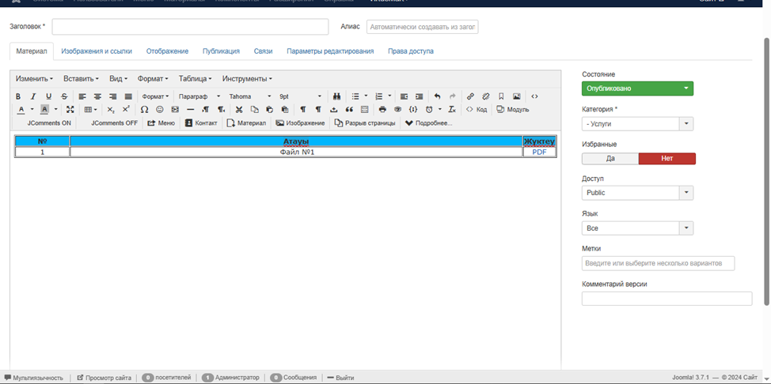
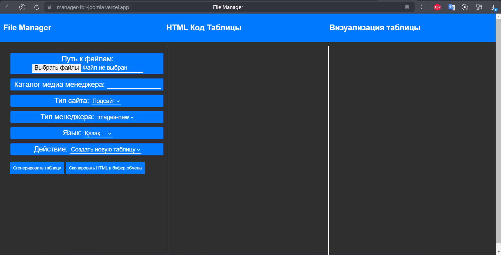
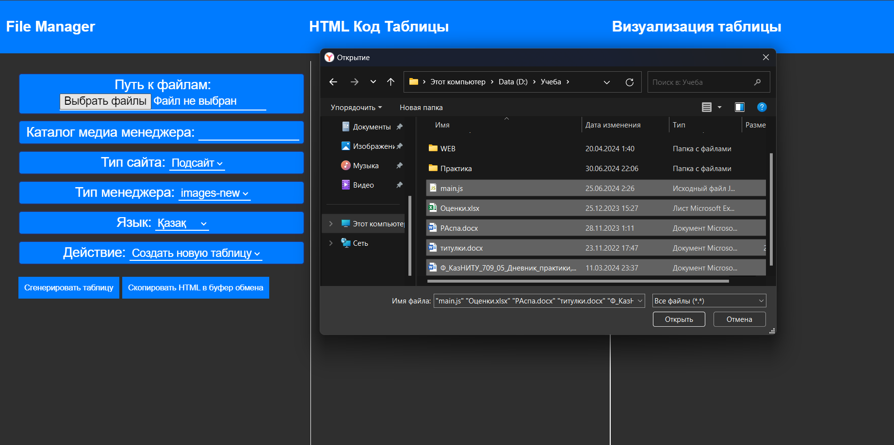
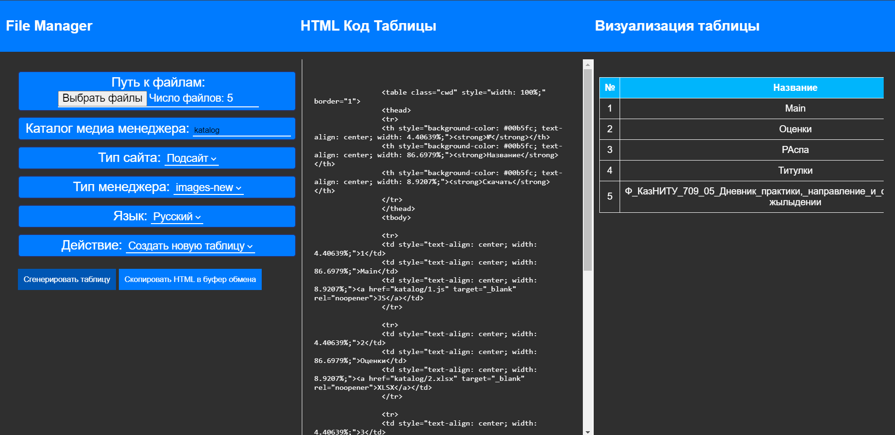
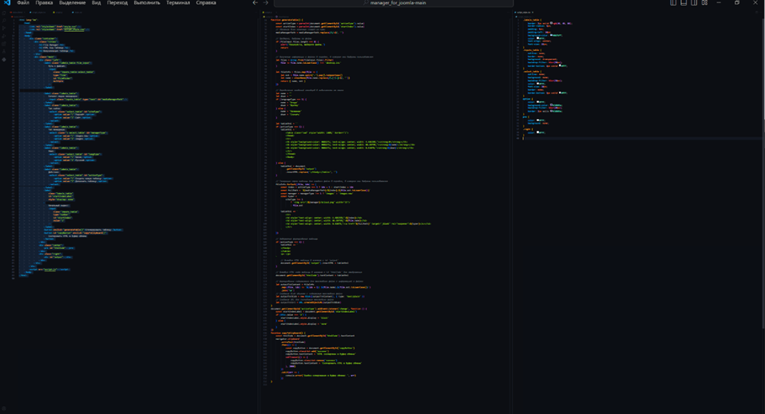

# Автоматическое создание таблиц для скачивания файлов в Joomla

## Описание проекта

Данный проект предназначен для автоматического создания таблиц на веб-сайтах, работающих на платформе Joomla. С его помощью пользователи могут легко размещать файлы для скачивания в таблицах, не затрачивая много времени и усилий на ручное заполнение и корректировку таблиц.

## Основные функции

- **Автоматическое создание таблиц:** Скрипт генерирует таблицы на основе готового шаблона, сохраняя все стили и структуру.
- **Коррекция ошибок:** В названиях файлов автоматически исправляются орфографические ошибки.
- **Добавление ссылок:** Скрипт автоматически вставляет ссылки на файлы в соответствующие ячейки таблицы.
- **Поддержка нескольких типов таблиц:** Возможность создавать таблицы разных типов в зависимости от требований пользователя (язык, файловая система, сортировка, вариации таблиц).
  
## Интерфейс программы  

## Как это работает

1. **Загрузка файлов:** Пользователь загружает файлы, которые должны быть отображены в таблице.
   
2. **Указание пути к файлу:** Указывается каталог в медиа-менеджере Joomla, куда будут загружены файлы.
3. **Выбор типа сайта:** Выбор между различными типами сайтов для определения содержимого третьего столбца таблицы.
4. **Определение типа менеджера:** Выбор между "старой" и "новой" версией Joomla, чтобы обеспечить совместимость.
5. **Настройка языка:** Выбор языка для заголовков таблиц.
6. **Указание стартовой точки:** Определение начального номера строки для новой таблицы.

## Преимущества использования

- **Сокращение времени:** Автоматизация создания таблиц значительно уменьшает время, необходимое для размещения большого количества файлов.
- **Уменьшение ошибок:** Снижение вероятности ошибок, связанных с ручным заполнением таблиц.
- **Удобство:** Процесс создания таблиц становится простым и интуитивно понятным, что облегчает работу пользователям любого уровня подготовки.

## Авторы

- [Dildar](https://github.com/Dildar05)

## Итог

Этот проект был разработан для компании **IT Group Kazakhstan** с целью значительного упрощения и ускорения процесса создания и управления таблицами для скачивания файлов на сайтах Joomla. Скрипт позволяет автоматизировать рутинные задачи, экономя время и минимизируя ошибки, что делает его незаменимым инструментом для веб-разработчиков и администраторов сайтов. Используйте наш скрипт для повышения эффективности и улучшения вашего сайта!
- Ссылка на [Meneger_for_Joomla](https://manager-for-joomla.vercel.app/)
---

